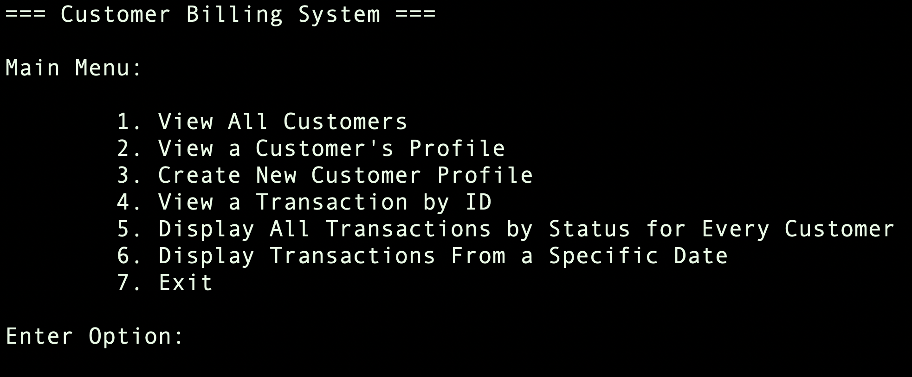
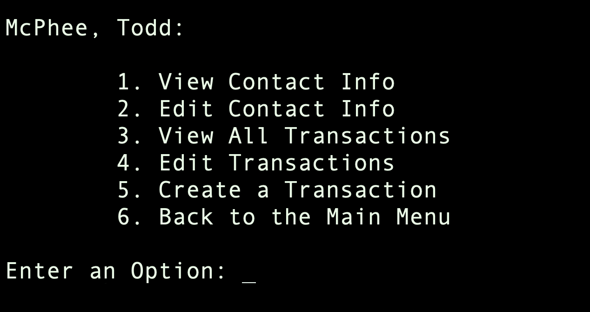
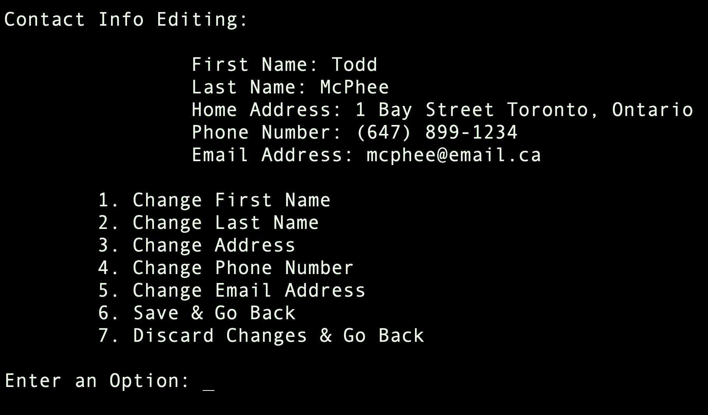
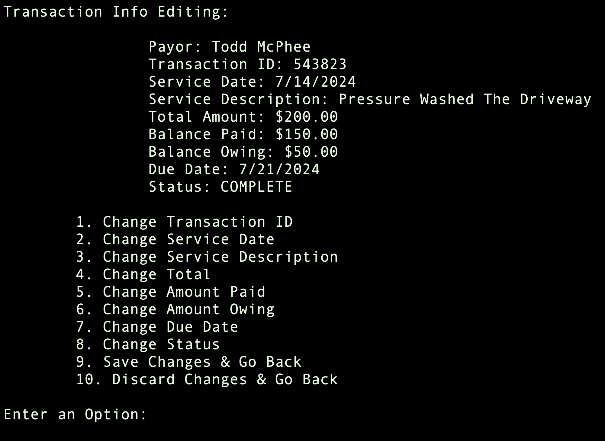

# Customer Billing System
Interactive command line interface application used
to manage customer profiles and transactions

## Setup

### Project Folder
Open your computer's terminal and cd to a directory of your choice.

Ensure [git](https://git-scm.com/) is installed on your system, then clone this repository using:

```sh
git clone https://github.com/Cortes205/Customer-Billing-System
```

or you can download it manually as a zipfile.

## Usage

### Execute
Open the terminal in the program's directory

Ensure you have the following:
* A C compiler
* Make tools

To run this program, use the following commands:

```sh
make
```

```sh
./bin/customerManager
```

The first command will compile all the files together, and
the second command will run the program in your terminal

### Runtime
#### Main Menu
 

1. View customers in alphabetical order by last name
2. Open a customer profile by inputting first and last name
3. Create a new profile with contact information
4. Input a transaction ID and view it no matter who it belongs to
5. Input a transaction status (e.g. ACTIVE, COMPLETE, etc.) and see all transactions with that status
6. Input a date to see transactions from that date
7. Exit the program

#### Customer Profile Menu


1. Display address, phone number, and email
2. Review contact information and choose what to change
3. Display all transaction details belonging to the customer's profile
4. Input a transaction ID (only IDs that belong to the customer will be accepted) 
and choose what information to change
5. Input all the necessary details to create a transaction
6. Return to the main menu

#### Customer Editing Menu


#### Transaction Editing Menu


## About This Project
This is a project suggestion that I saw online; however, I wanted to do 
it in my own way. The goal was to implement HashMaps as practice for 
my next semester. However, that isn't efficient for many tasks. Therefore,
I have also utilized LinkedLists and Arrays. All customer and transaction nodes
are accessible from many different pointers. The nodes are accessed in the most
efficient way possible (depending on the task). For example: searching for a customer
by name or a transaction by id will be done through the HashMap pointers in O(1) time complexity. Or, displaying
all customers will be done through the LinkedList in O(n) time complexity 
(sorted in O(nlog(n)) first). Although my testing was done with a small database,
this program would be very efficient if there was a database of thousands of customers
with thousands of transactions.


This project has been good practice for my next semester where I will learn more about
Data Structures & Algorithms. I am working ahead by learning about HashMaps and
refining my skills in C by Merge Sorting words in a LinkedList, Binary Searching, managing lots of pointers, files, 
and memory!

[Linkedin](https://www.linkedin.com/in/cortes205/)
